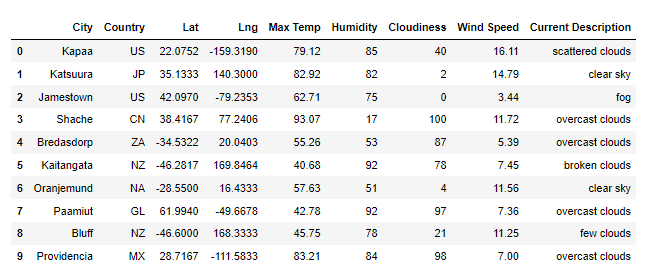

# World_Weather_Analysis
In this project, we intend to use WeatherMap API, GMAPs Places & Directions APIs to create advanced location, weather, and accommodations maps that enhance the client's search capabilities and hopefully draw more clients to to PlanMyTrip website. 

## Background 

PlanMyTrip is a top travel technology company that specializes in internet related services in the hotel and lodging industry.  

The head of analysis for the user interface team at the PlanMyTrip company has asked us to collect and present data for customers via the search page, which they will then filter based on their preferred travel criteria in order to find their ideal hotel anywhere in the world.  

#### First Stage Analysis: Building the App
To perform this task we plan on taking the follwoing steps: 
- using a Jupyter notebook, and the CitiPy module to get the cities for more than 500 random latitudes and longitudes.
- Then perform requests on the OpenWeatherMap API and retrieve the JSON weather data from these cities. 
- The weather data will be added to a Pandas DataFrame, where we will use Matplotlib to create a series of scatter plots to show the relationship between latitude and a variety of weather parameters for over 500 cities around the world. 
- As part of our analysis, we will need to perform statistical calculations on the data using linear regression on the weather parameters in the northern and southern hemispheres. This data will help our team predict the best time of year for people to plan their vacation. 
- Finally, we will export the data, clean it, and use the weather data to choose the best cities for vacation based on certain weather criteria and then map these cities using Jupyter G maps and the Google Places API. 

#### Second Stage Analysis: Upgrade the App
PlanMyTrip Analysis Team and Beta testers love it the app. And, as with any new product, they have recommended a few changes to take the app to the next level. Specifically, they recommend adding the weather description to the weather data we had already retrieved in the first stage of the project. Then, we will have the beta testers use input statements to filter the data for their weather preferences, which will be used to identify potential travel destinations and nearby hotels. From the list of potential travel destinations, the beta tester will choose four cities to create a travel itinerary. Finally, using the Google Maps Directions API, we will create a travel route between the four cities as well as a marker layer map.

### Purpose
#### Second Stage
In this project we will use a Jupyter notebook, Pandas Library, the Python CitiPy module, Python Requests, APIs, and JSON Traversals to collect weather data from over 500 cities around the world.  
We will then analyze the data using pandas and plot the data using the matplotlib library and Google Maps API.   
Finally, you will perform a statistical analysis with the SciPy Library.  
The end results will be a series of plots that visually and statistically show the relationship between latitude and a variety of weather parameters. 

## Objectives

### Second Stage: Upgrade the App
1. Retrieve Weather Data
2. Create a Customer Travel Destinations Map
3. Create a Travel Itinerary Map

## Resources
- Data Source: 
- Software: Anaconda (4.11.0), Python (3.7.6).
- Libraries and Packages: Pandas, NumPy, Jupyter notebook, Matplotlib, Python CitiPy module, Python Requests, APIs, JSON Traversals, SciPy. 
- Online Tools: WeatherMap API, Google Maps Places API, Google Maps Directions API[World Weather Analysis GitHub Repository](https://github.com/Magzzie/World_Weather_Analysis)

## Methods 

1. Retrieve Weather Data: 
    - We generated a set of 10,000 random latitudes and longitudes, retrieved the nearest city, and performed an API call with the OpenWeatherMap. 
    - In addition to the city weather data we gathered in the first stage of the project, we used our API skills to retrieve the current weather description for each city. 
    - Then, we created a new DataFrame containing the updated weather data.

2. Create a Customer Travel Destinations Map:
- We used input statements to retrieve customer weather preferences, then used those preferences to identify potential travel destinations and nearby hotels. Then, show those destinations on a marker layer map with pop-up markers.

3. Create a Travel Itinerary Map:
- We used the Google Directions API to create a travel itinerary that shows the route between four cities chosen from the customer’s possible travel destinations. 
- Then, we created a marker layer map with a pop-up marker for each city on the itinerary.

## Results

1. Retrieving Weather Data: 
    - From 10000 randomly generated latitudes and longitudes of 753 cities, we were able to retrieve information about 1478 cities. 
    - We started the upgrade analysis by adding the weather description to the weather data we had already retrieved in the first stage of the project.
    - We performed an API call and retrieved certain information about each city in our list, then collected them all in one DataFrame.  
        
        ||
        |-|

2. We created a filtering option to allow the beta testers to use input statements to filter the data for their weather preferences, which will be used to identify potential travel destinations and nearby hotels.  
        
    ||
    |-|

3. To enable users to interact with our vacation maps even further, we created a travel itinerary map. 
- From the list of potential travel destinations, the beta tester will choose four cities to create a travel itinerary. 
- After that we would create a travel route between the four cities as well as a marker layer map using the Google Maps Directions API, 
- For example, if the user wishes to take a road trip in the north east side of spain, they can start at Valls near Barcelona, drive northwest to Huesca, then west to Soria and back southeast to Valls through Zaragoza.  

    ||
    |-|    
    
- We were able to add a travel layer for the road and another for the markers with information about the city's hotel, temperature and weather condition.  

    - Travel Map: 
    
        ||
        |-|
    
    - Info Map:  
    
        ||
        |-|
        
## Conclusions
*Bon Voyage!*

---

